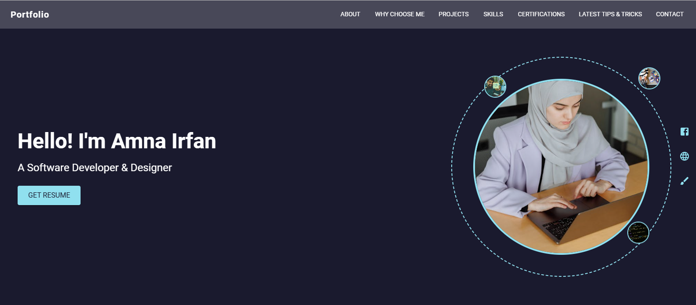
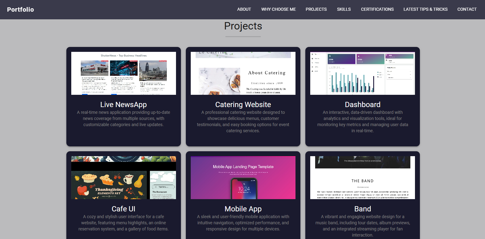
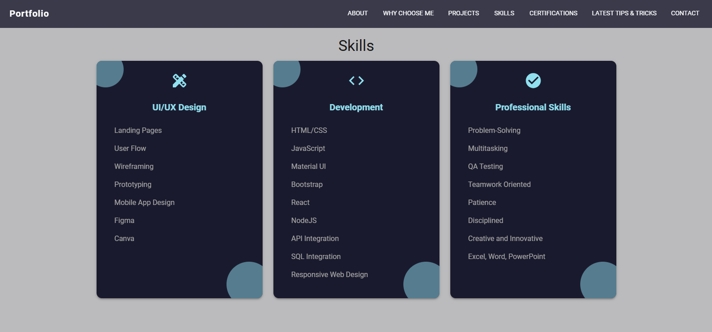

# Portfolio Website

A modern, interactive personal portfolio website built with **React.js** and **Material UI (MUI)**. This project showcases my skills as a Frontend Developer & UI Designer, with smooth hover effects on cards and text for an engaging user experience.

Designed to highlight projects, skills, about section, and contact information in a clean, responsive layout.

## 📦 Technologies Used
- React.js
- Material UI (MUI) for components, theming, and responsive design
- CSS (with MUI's sx prop for custom styling)
- React Router 
- Framer Motion or CSS transitions

## 🦄 Features
Here's what makes this portfolio stand out:

- **Responsive Design** – Looks great on mobile, tablet, and desktop using MUI's grid system
- **Hover Effects** – Smooth animations on project cards (scale, shadow, overlay text/color change)
- **Text Hover Effect** – Special hover animation on one key text element (e.g., name, tagline, or call-to-action)
- **Project Showcase** – Cards displaying projects with images, descriptions, tech stack, and links (GitHub + Live Demo)
- **About & Skills Section** – Clean presentation of bio, expertise, and tools
- **Contact Form / Links** – Easy way to reach out 
- **Modern UI** – Clean typography, subtle animations, and MUI's polished components

## 🎯 Highlights & What I Focused On
- **Hover Interactions**: Added engaging hover states to project cards (scale up, shadow lift, overlay with details) and one special text hover (e.g., underline animation, color change, or reveal effect)
- **MUI Theming**: Customized MUI theme for consistent colors, typography, and spacing
- **Performance**: Optimized images and lazy loading where needed
- **Accessibility**: Used semantic HTML and MUI's accessible components

## 👩🏽‍🍳 The Process & What I Learned
Set up React + MUI project.

Key learnings:
- Advanced hover effects using CSS transitions and MUI's sx prop
- Creating reusable card components with dynamic props
- Customizing MUI theme globally for brand consistency
- Balancing animations so they feel smooth but not overwhelming
- Making sure the site loads fast and looks good on all devices

## 💭 How Can It Be Improved?
- Add dark/light mode toggle
- Implement animations on page load (Framer Motion)
- Add a blog section or case studies
- Integrate contact form with EmailJS or backend
- Add particle background or subtle scroll effects
- SEO optimizations (meta tags, React Helmet)
- Add more interactive elements (e.g., 3D tilt on cards)

## 🚦 Running the Project Locally
1. npm start

## Screenshots

### Portfolio 

